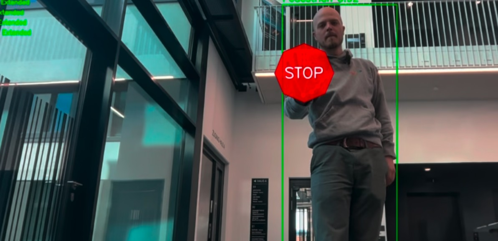
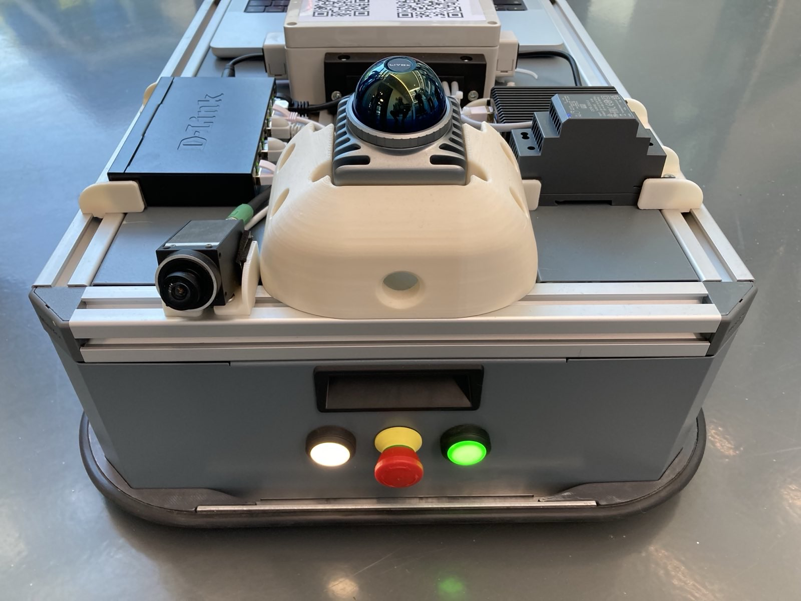

# Documentation for WALL-E


## Build Backend

To build the FastAPI backend, run the following commands:

```bash
cd brain
python -m venv .venv
source .venv/bin/activate
pip install -e .
touch .env
```

Create a **.env** file or set the parameters using `export`:

```bash
OPENAI_API_KEY=<YOUR-KEY-GOES-HERE>
OPENAI_MODEL=openai/gpt-4o
MAX_TOKENS=10000
```

Great! You have successfully built and set up the backend 🚀.

Now it’s time to get some real work done!

> [!NOTE]  
> If your robot is not using the IP **192.168.24.82**, update it in the `brain/settings.py` file accordingly.

---

## Start Backend

Run the backend using one of the following commands:

```bash
python run.py
# or
uvicorn brain.routes:app --reload --log-level=critical --host=0.0.0.0 --reload
```

You should see output similar to this:

```bash
2025-05-11 10:17:47.115 | INFO     | brain.manager:__init__:36 - Initializing Manager
2025-05-11 10:17:47.115 | INFO     | brain.manager:loop:50 - Event loop started
2025-05-11 10:17:47.115 | INFO     | brain.manager:__init__:45 - Manager daemon thread started
2025-05-11 10:17:47.118 | INFO     | brain.fast_api:startup_event:31 - 🚀 FastAPI app is starting up...
2025-05-11 10:17:48.116 | INFO     | brain.manager:work_mode:153 - Executing work_mode
```

Access the API documentation at:

```bash
http://<YOUR-IP>:8000/docs
```

---

## Send Data to Backend

You can use the web interface or a `curl` command to send data to the backend.

This is useful if you want to send simple commands and have them interpreted by the AI model.

```bash
curl -X 'POST' \
  'http://<YOUR-IP>:8000/command' \
  -H 'accept: application/json' \
  -H 'Content-Type: application/json' \
  -d '{
  "message": "warte das du beladen bist  fahre zur position_home vordefinierten"
} '
```

The robot will perform a movement based on the interpretation.

---

### Additional Commands

- **/stop**: Stops the robot immediately.
- **/resume**: Resumes the movement to the last target position.
- **/interrupt**: Currently not used.

---

## Send Data to Backend Automatically

So far, you’ve started the backend and sent REST API commands manually. But wouldn’t it be cooler to automate this process?

Now, you can speak to the robot, and it will perform its movements automatically.

Navigate to the main repository folder and install all requirements:

> [!NOTE]  
> Install the camera driver to see the RGB image. You can download the Baumer NeoAPI software [here](https://www.baumer.com/de/en/product-overview/industrial-cameras-image-processing/software/baumer-neoapi/c/42528).

```bash
pip install -r gesture/requirements.txt
pip install -r requirements.txt
```

---

### Start the Camera

Run the following command to start the camera:

```bash
python gesture/gesture_recognition.py
```

When you are in front of the robot and perform a stop gesture, the output should look something like this:



---

### Start Voice Recognition

Run the following command to start voice recognition:

```bash
python gesture/whisper_mic.py
```

---

# Next Steps

Try more things! You can also speak to the robot. For example, say **move two meters forward**, and the robot will move. If you stop it with a gesture, it will pause and continue its movement when you step out of the way.

Happy hacking! 😉

